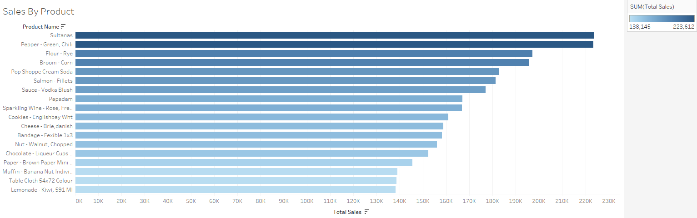
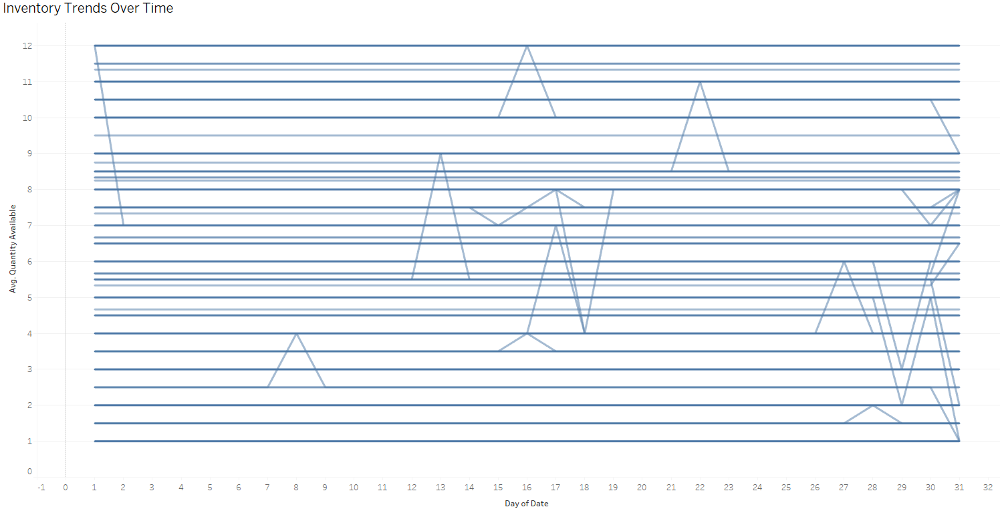
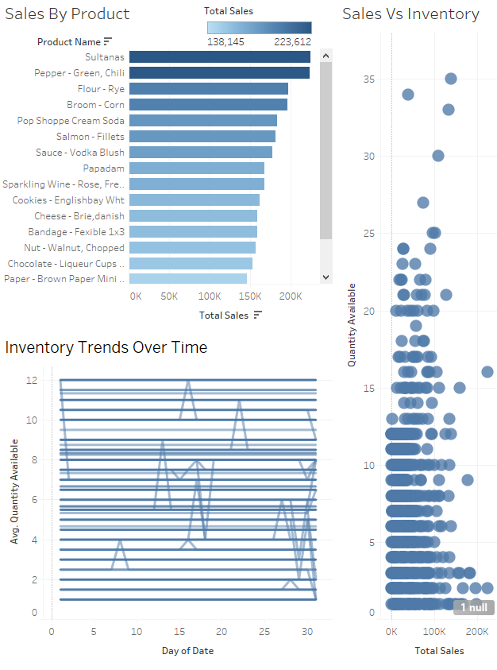

# Sales-Inventory-Analysis
A SQL + Tableau project analyzing retail sales and inventory data

📊 Sales & Inventory Data Analysis (SQL + Tableau)

This project analyzes sales and inventory data for a nationwide retail business. It was created to demonstrate data cleaning, transformation, and insight generation using SQL (BigQuery style) and Tableau visualizations. The final dashboard helps identify stock issues, profit trends, and product performance.

---

🚀 Project Goal

Help retail businesses improve stock management, identify high-performing products, and use data-driven strategies to reduce overstock and stockouts while maximizing profits.

---

🔍 Key Questions Answered

- What are the most profitable and best-selling products?
- Which product categories are underperforming?
- What are the monthly and yearly trends in inventory and sales?
- Which products need immediate restocking?

---

🛠 Tools & Skills Used

| Tool              | Purpose                                |
|-------------------|----------------------------------------|
| SQL (BigQuery)    | Data cleaning, transformation, queries |
| Excel (Optional)  | Preprocessing CSVs                     |
| Tableau           | Visualizations and dashboards          |
| Google Cloud (GCP)| BigQuery hosting and querying          |

---

📂 Dataset Summary

- `sales.csv`: Transaction data (quantities, dates, prices)
- `inventory.csv`: Current stock levels by product
- `products.csv`: Product catalog with categories and IDs

All datasets were uploaded to **BigQuery** for SQL-based analysis.

---

🔎 SQL Scripts Included

📌 **Data Cleaning**
- `clean_sales.sql` – Prepares sales data by fixing missing values
- `clean_inventory.sql` – Cleans inventory dataset

📌 **Insights & Business Logic**
- `sales_trends.sql` – Monthly & yearly sales tracking
- `top_products.sql` – Identifies best-selling products
- `low_stock_alerts.sql` – Flags items running low
- `category_performance.sql` – Category-level sales insights
- `profit_analysis.sql` – Calculates profit margins

---

📸 Visual Highlights

### 🏆 Sales by Product

---

### 📦 Inventory vs Sales

---

### 📈 Inventory Trends Over Time

---

### 🧩 Final Dashboard Overview

_(Dashboard built in Tableau — file: `Sales_Inventory_Analysis.twbx`)_

---

📌 Key Insights

- 📦 Inventory issues were visualized clearly across months
- 🛒 Top products were identified using real sales data
- 🚨 Low stock alerts helped plan proactive restocking
- 💰 Profit margins analysis highlighted category strengths

---

🧪 How to Recreate This Project

1. Clone this repo and download all files
2. Upload `.csv` datasets into BigQuery
3. Run the `.sql` scripts in GCP
4. Open `Sales_Inventory_Analysis.twbx` in Tableau to view the dashboard

---

🔮 Future Enhancements

- Embed live Tableau Public dashboard (coming soon)
- Automate restock alerts with scheduled queries
- Integrate Google Sheets API or POS system for real-time updates

---

👤 Author  
**Akash Pandya**  
Freelance Data Analyst | SQL, Tableau, Excel, R  
🌐 [Portfolio Website](https://aakashpandya.netlify.app)  
📊 [GitHub](https://github.com/akashpandya)  
💼 [LinkedIn](https://www.linkedin.com/in/akash-pandya100/)

